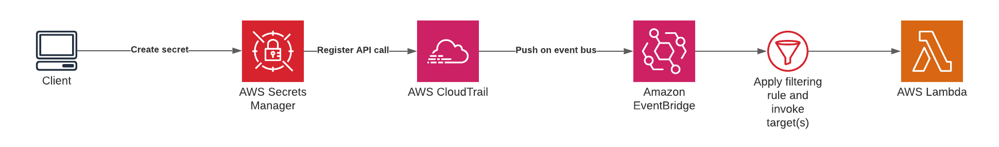

# Monitor Secrets Manager lifecycle events using AWS EventBridge

## Goal

Plug into Secrets Manager lifecycle events using AWS CloudTrail and AWS EventBridge

## Architecture

## Solution

Leverage AWS EventBridge using CloudTrail to filtering on Secret Manager lifecycle events.

## Project structure

- `scripts`: Contains 2 small `zx` helper scripts to perform an operation in Secrets Manager.
- `infra`: Contains a AWS CDK project containing the infrastructure for the solution.

## Setup

- `cdk deploy` in the `infra` folder to deploy the infrastructure.
- `npx zx scripts/secrets-manager-create-lifecycle-event.mjs` to create a secret. This will create an event that will be picked up by the rule configured in the infrastructure
- `npx zx scripts/secrets-manager-delete-lifecycle-event.mjs` to delete a secret. This will create an event that will be picked up by the rule configured in the infrastructure
